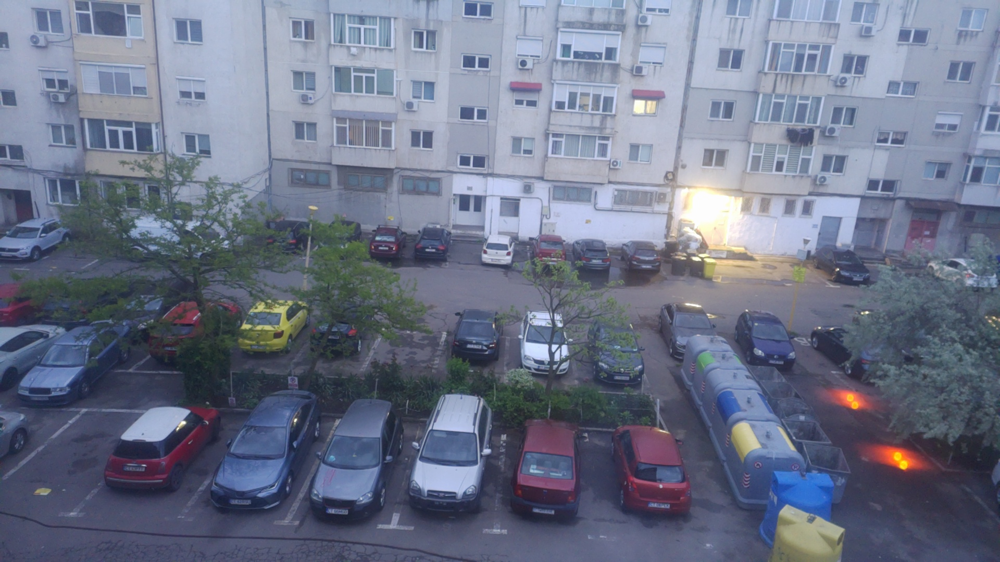
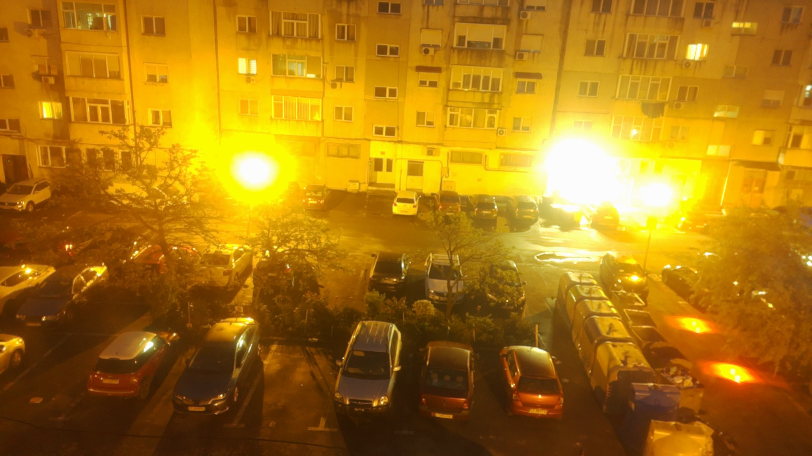

# Parking Monitor

Real-time parking spot occupancy detection and security sentinel running on a Raspberry Pi 5 with a Hailo-8 AI accelerator. Detects vehicles and pedestrians at the edge — no cloud, no latency.


<table>
<tr>
<td></td>
<td></td>
</tr>
<tr>
<td align="center"><em>Day mode — live camera view</em></td>
<td align="center"><em>Auto night mode — long exposure + high gain</em></td>
</tr>
</table>

---

## Features

**Parking occupancy**
- Draw any number of polygonal parking spots directly on the live feed (click 4 corners)
- Confidence-weighted IoU overlap detects vehicles reliably even with partial views
- Time-based state machine: 1 s to confirm OCCUPIED, 7.5 s absence to confirm FREE
- Occupancy duration displayed live on screen and in the side panel

**Security sentinel**
- Define an alert zone around each spot (second polygon, press `X`)
- Detects pedestrians loitering ≥ 4 s near an occupied spot
- Automatically records a 10-second H.264 video clip and sends it to Telegram

**Auto night mode**
- EMA luma measurement on the centre ROI of each frame
- Hysteresis band prevents oscillation at dusk/dawn
- Switches camera to long-exposure + high-gain mode automatically

**Camera stabilization**
- ORB feature matching + RANSAC homography every 3 s
- Parking polygons warp automatically if the camera is nudged
- Status shown on screen: `STAB OK` / `DRIFT` / `LOST`

**Telegram integration**
- Instant alerts when a spot becomes OCCUPIED or FREE (with cooldown)
- Photo snapshot attached to every state-change alert
- 10-second video clips on security events (transcoded to H.264 via ffmpeg)
- Send `/snap` to the bot at any time for an on-demand live snapshot

**Web dashboard**
- MJPEG live feed at `http://<pi-ip>:8080`
- JSON status endpoint at `/status.json`
- Works from any browser on the local network

**Traffic heatmap**
- Toggle an INFERNO colormap overlay showing cumulative vehicle paths (`H` key)

---

## Hardware

| Component | Details |
|---|---|
| Raspberry Pi 5 | 8 GB RAM |
| Camera | Camera Module 3 (IMX708), 1920×1080 |
| AI accelerator | Hailo-8, 26 TOPS, PCIe M.2 |
| Model | YOLOv8m — 6 COCO classes |

---

## Detected classes

| Class | Used for |
|---|---|
| Car, Truck, Bus, Motorcycle, Bicycle | Parking occupancy |
| Pedestrian | Security zone loitering detection |

---

## Requirements

```bash
pip install picamera2 opencv-python numpy scipy requests
# Hailo SDK: hailo_platform (installed via Hailo RPi5 package)
```

---

## Quick start

```bash
# Clone
git clone https://github.com/rusurazvancristian/parking-monitor.git
cd parking-monitor

# (Optional) Configure Telegram
cp config.example.json ~/.traffic_counter.json
nano ~/.traffic_counter.json  # fill in telegram_token and telegram_chat_id

# Run
python3 traffic_counter.py

# Start fresh (clears saved spots and config)
python3 traffic_counter.py --reset
```

---

## Keyboard controls

| Key | Action |
|---|---|
| `P` | Add a parking spot — click 4 corners on the live feed |
| `X` | Add a security alert zone for the last spot |
| `Backspace` | Remove the last parking spot |
| `H` | Toggle heatmap overlay |
| `V` | Toggle night mode manually |
| `S` | Send a snapshot to Telegram immediately |
| `C` | Recalibrate the camera stabilizer |
| `F` | Full reset — clear all spots and state |
| `Q` / `Esc` | Quit |

---

## Configuration

Saved automatically to `~/.traffic_counter.json` after each spot definition.

```json
{
  "cam_w": 1920,
  "cam_h": 1080,
  "disp_w": 1280,
  "disp_h": 720,
  "telegram_token": "",
  "telegram_chat_id": "",
  "parking_spots": []
}
```

---

## Logs

Written to `~/traffic_logs/`:

| File | Contents |
|---|---|
| `parking_YYYYMMDD.csv` | Timestamp, spot name, event (OCCUPIED/FREE), duration in seconds |
| `app_YYYYMMDD.log` | Full application log |

---

## Architecture

```
Camera (picamera2)
    │
    ▼
Letterbox resize → Hailo-8 (YOLOv8m, PCIe)
    │
    ▼
NMS detections → IoU Tracker (Hungarian algorithm + constant-velocity prediction)
    │
    ├─→ Parking state machine  ──→ Telegram alerts + CSV log
    ├─→ Security zone detector ──→ Video recording + Telegram video
    ├─→ Camera stabilizer      ──→ Homography warp on parking polygons
    ├─→ Heatmap accumulator
    └─→ Renderer + Web dashboard (MJPEG / JSON)
```

---

## License

MIT
